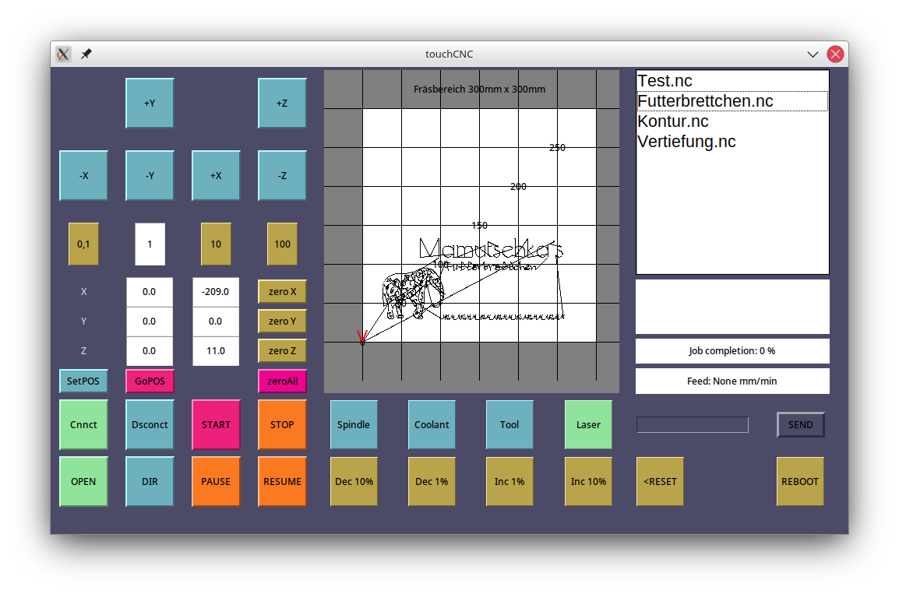

# touchCNC 1.0
GRBL 1.1 CNC Controller for ODROID C2 with VU PLus Touch Screen or Linux Desktop

Should run on any System wit at least 1024x600 Screen Resolution. 

- Jog 
- Zero positions 
- Job commands 
- Spindle Coolant, Tool and Macro commands 
- Gcode milling envelope preview 
- G28 Position
- Feed override (Not yet working)
- terminal
- Laser status and switch

- 
- Tested on latest Armbian stable https://www.armbian.com/odroid-c2/#kernels-archive-all
- Tested on Manjaro 
- Using cncpro v3 with grbl1.1f

## Clone to your PC
`git clone https://github.com/BKLronin/touchCNC.git`

## Install 
- (Create env)  
- In folder enter:  
`pip install requirements.txt`  

## Run 
`python cnc_gerbil.py`    
or    
`cd dist`  
`./cnc_gerbil`  (Bundled pyinstaller executable)

## Settings
`nano settings.py`  
or any other editor to setup to your specific usecase, the options are:

- The resolution of your SBC-screen  
`resolution = '1024x600+0+0'`

- When running on SBC with touch set to: True  
`set_fullscreen = False`

- Platform dependent com ports  
`portlist = ['/dev/ttyUSB0', '/dev/ttyACM0', '/dev/ttyUSB1', '/dev/ttyACM1', '/dev/ttyACM2', '/dev/ttyACM3',
                     '/dev/ttyS0', '/dev/ttyS1', '/dev/ttyS2', '/dev/ttyS3']`
  

- Where the file dialog points to. Ideally some Nextcloud folder or Samba share etc.  
`basepath = '/home/'`

  
- Machine commands  
`spindle_on = 'M3S1000'  `  
`spindle_off = 'M5'`  
`cooling_on = 'M8' `   
`cooling_off = 'M9'  `  
`toolchange = 'G10 P0 L20 X0 Y0 Z0'  ` 
  

- Table Info Text  
`table_text = 'Fräsbereich 300mm x 300mm'`

### Based on:
Python3  
tkinter  
pyserial  
gerbil  

